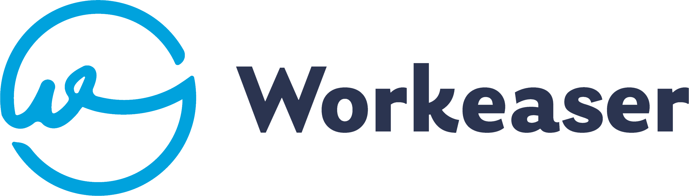

# Projeto for Workeaser System



<p align="center">


</p>

To view project online visit: [View project online](https://workeaser-system.vercel.app/)

## Use and Setup

### For first time use, install the dependencies

```bash
yarn
```

or

```bash
npm install
```

### To run the app locally:

To start the servers, run the following commands in separeted consoles.

```bash
yarn dev
```

<!-- and then:

```bash
yarn serve
```

Open [http://localhost:3000](http://localhost:3000) to view it in the browser.

The page will reload if you make edits.\
You will also see any lint errors in the console. -->
